# Budgetly - For Firefly III

## A Firefly iii Mobile Companion

A beautiful, modern React Native app for managing your personal finances with Firefly III.

> **⚠️ Disclaimer:**  
> This app is in early beta and is **just starting development**. Please do **not rely on this app** for critical tasks, and use it **at your own risk**. The author will **not be responsible for any data loss, issues, or damages** arising from its use.  
> Always keep a backup of your important data in your Firefly III instance before trying experimental software.

## 🗺️ Roadmap

- [x] Secure Connect with firefly instance
- [x] Dashboard
- [x] Accounts Management
- [x] Transactions Management
- [ ] Budgets
- [ ] Piggy bank
- [ ] Subscription management
- [ ] Tag management
- [ ] Recurring transaction improvements
- [ ] Advanced filtering and search
- [ ] Advanced charts and analytics
- [ ] Budget categories and tags
- [ ] Export functionality
- [ ] Multiple currency support
- [ ] Biometric authentication
- [ ] Theme customization options
- [ ] Push notifications for recurring transactions
- [ ] Offline Support (Semi implemented)
- [ ] Offline transaction creation with sync
- [ ] And a lot of new features requested by community

---

## Screenshots

<div align="center">

| Accounts-1                           | Accounts-press-hold                                    | Dashboard-1                            |
| ------------------------------------ | ------------------------------------------------------ | -------------------------------------- |
| 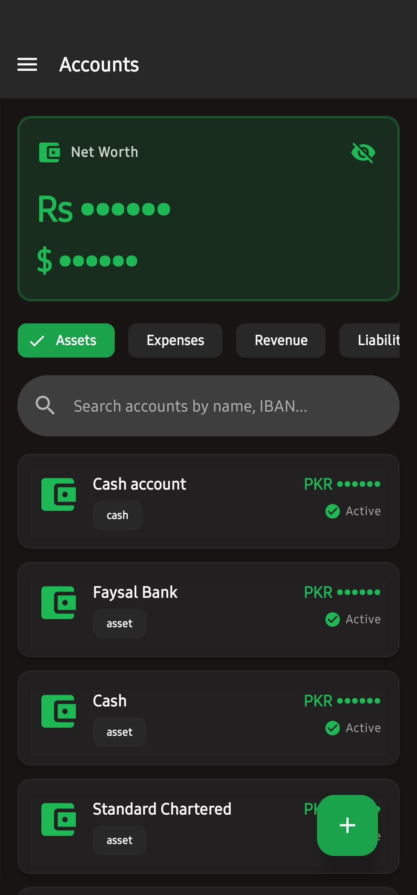 | 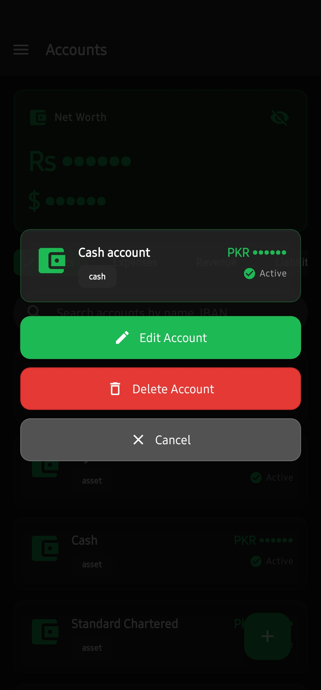 | 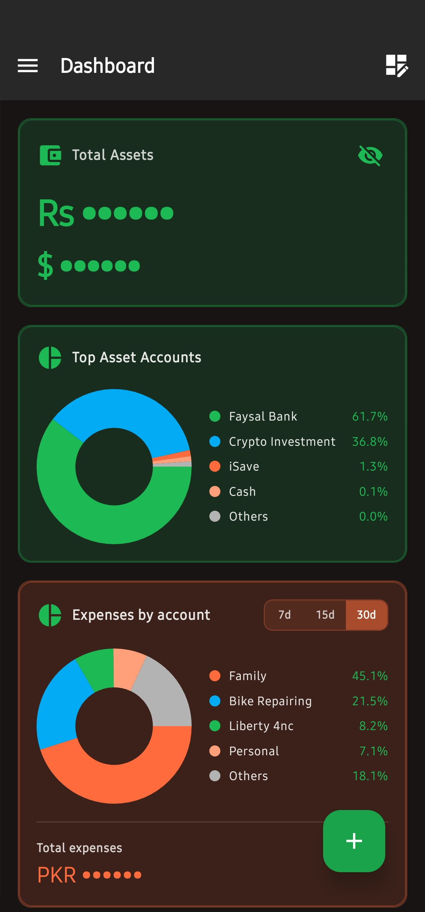 |

| Dashboard-2                            | Dashboard-3                            | Dashboard-4                            |
| -------------------------------------- | -------------------------------------- | -------------------------------------- |
| 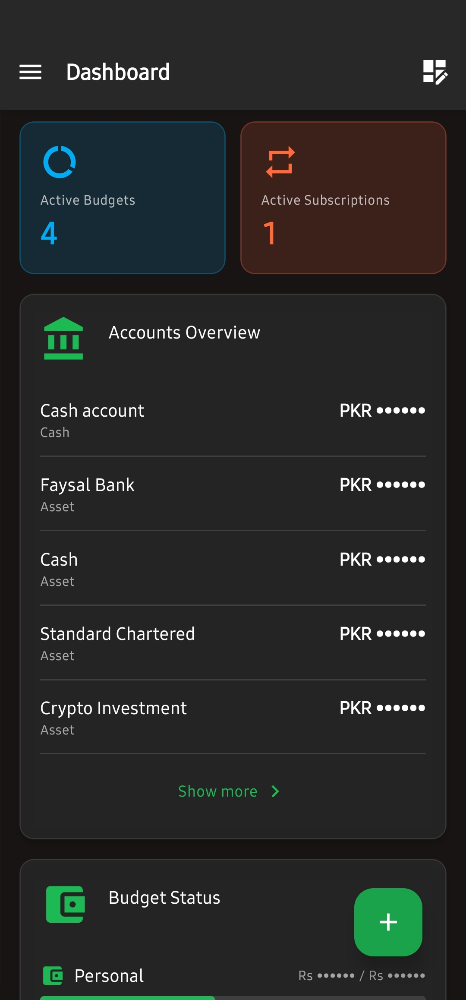 | 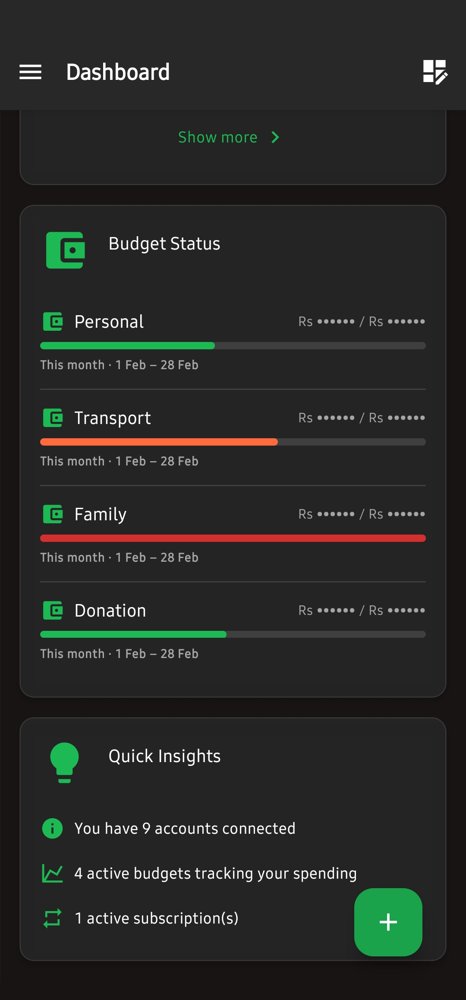 | 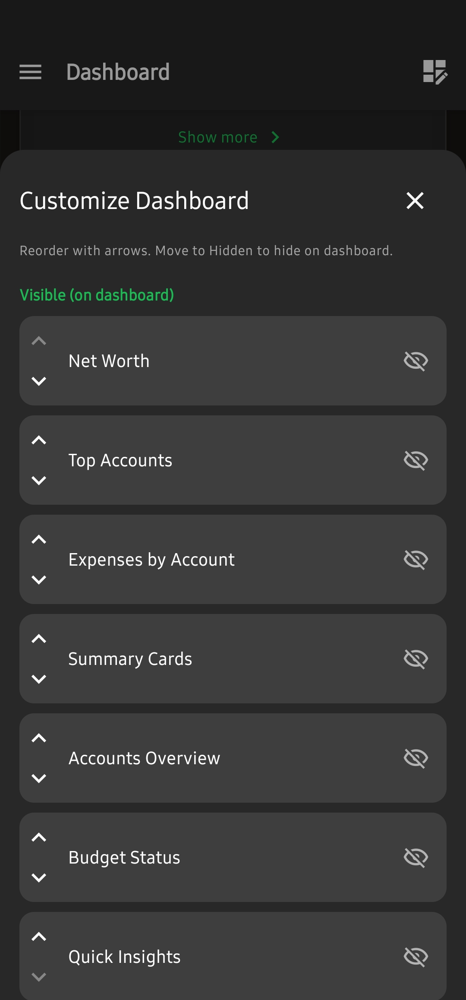 |

| create-account-1                                 | create-account-2                                 | create-transaction-1                                     |
| ------------------------------------------------ | ------------------------------------------------ | -------------------------------------------------------- |
| 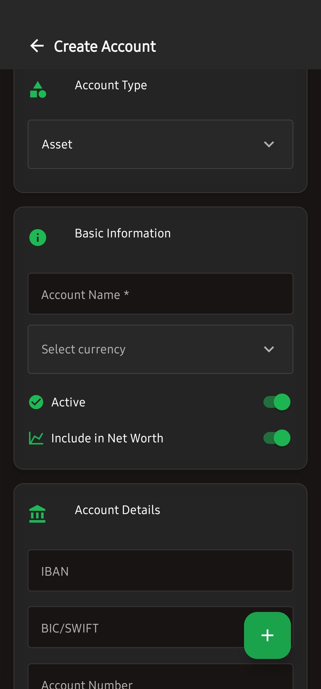 | 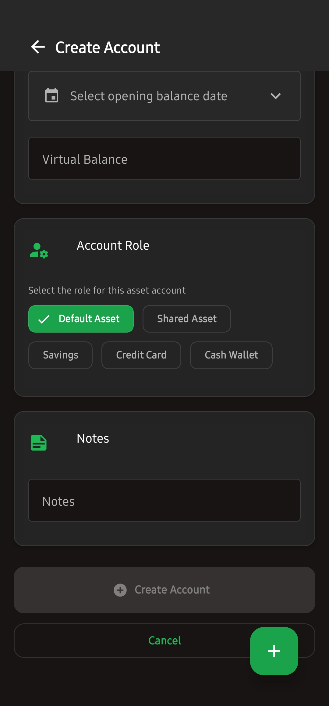 | 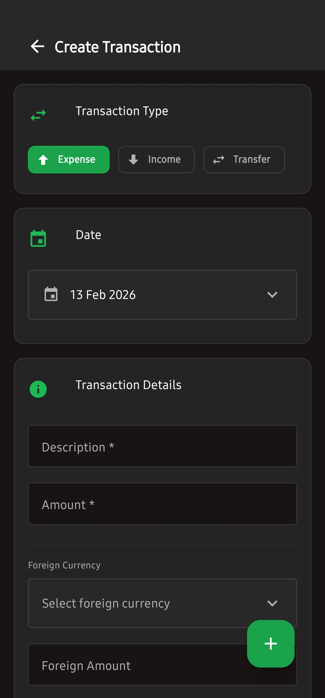 |

| create-transaction-2                                     | transactions-1                               | transactions-press-hold                                        |
| -------------------------------------------------------- | -------------------------------------------- | -------------------------------------------------------------- |
| 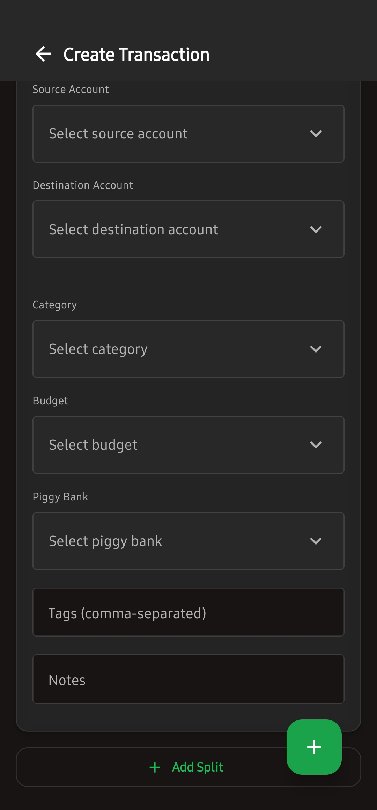 | 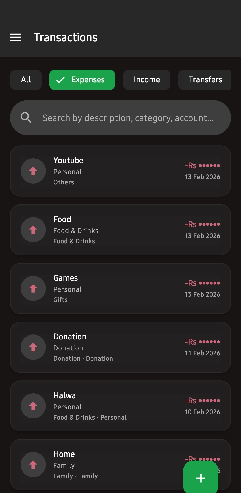 | 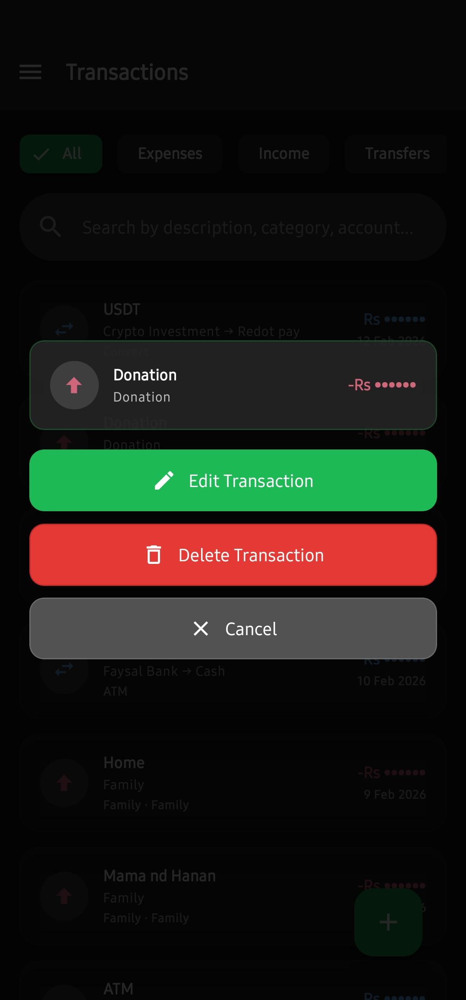 |

</div>

## 🛠️ Tech Stack

- **Framework**: Expo (React Native)
- **Language**: TypeScript
- **UI Library**: React Native Paper (Material Design 3)
- **Theme**: Spotify-inspired black and green color scheme
- **Navigation**: Expo Router with Drawer Navigation
- **State Management**: Zustand (for app state) + TanStack Query (for server state)
- **API Client**: Axios
- **Secure Storage**: Expo Secure Store
- **Charts**: Victory Native

## 📋 Prerequisites

- Node.js 18+
- npm or yarn
- Expo CLI
- A running Firefly III instance
- Personal Access Token from your Firefly III instance

## 🔧 Installation

1. Clone the repository:

```bash
git clone https://github.com/mHamzaIqbal1998/Budgetly.git
cd budgetly
```

2. Install dependencies:

```bash
npm install
```

3. Start the development server:

```bash
npm start
```

4. Run on your device:
   - **iOS**: Press `i` or run `npm run ios`
   - **Android**: Press `a` or run `npm run android`
   - **Web**: Press `w` or run `npm run web`

## 🔐 First Launch Setup

1. Launch the app
2. Enter your Firefly III instance URL (e.g., `https://firefly.example.com`)
3. Enter your Personal Access Token
4. Tap "Connect"

The app will validate your credentials and connect to your instance.

## 📱 Screens

### Dashboard

- Financial overview with summary cards/charts
- Accounts/Subscriptions/Budgets overview cards
- Quick insights

### Transactions

- List all transactions
- Search and filter capabilities
- Create new expenses, income, or transfers
- Delete transactions

### Accounts

- View all connected accounts
- See balances and account types
- Net worth calculation

### Budgets

- View all budgets with progress bars
- See spending vs. limits
- Create new budgets

## In development

### Piggy Banks

- Track savings goals
- View progress towards targets
- See remaining amounts

### Subscriptions

- Manage recurring transactions
- View frequency and amounts
- Track active/inactive subscriptions

### Settings

- Update Firefly III credentials
- View app information
- Sign out

## 🔒 Security

- Personal Access Tokens are stored using Expo Secure Store (encrypted native storage)
- No credentials are ever logged or transmitted to third parties
- All API calls go directly to your Firefly III instance
- No telemetry or tracking

## 🔌 API Integration

The app uses the Firefly III REST API v1. All endpoints are documented at:
https://api-docs.firefly-iii.org/

## 📦 Building for Production

### Android

You need to set eas credentials for build

```bash
npm run build:android:local
```

This will build the app for Android using the EAS build system locally.

> **TODO:** Add instructions for building the app for iOS.

## 🤝 Contributing

We welcome contributions from the community. To contribute, please fork the repository, create a new branch based on the `dev` branch, and submit your Pull Request to the `dev` branch for review.

## 📄 License

This project is licensed under the MIT License.

## 🙏 Acknowledgments

- [Firefly III](https://www.firefly-iii.org/) - The amazing personal finance manager
- [React Native Paper](https://reactnativepaper.com/) - Material Design components
- [Expo](https://expo.dev/) - React Native development platform

## 📞 Support

For issues related to:

- **This app**: Open an issue in this repository
- **Firefly III**: Visit https://github.com/firefly-iii/firefly-iii

Made with ❤️ for Firefly III users by [M Hamza Iqbal](https://mhamzaiqbal1998.vercel.app).
